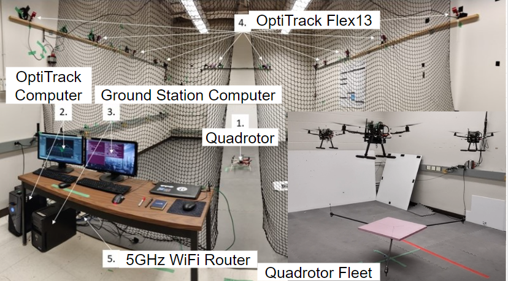
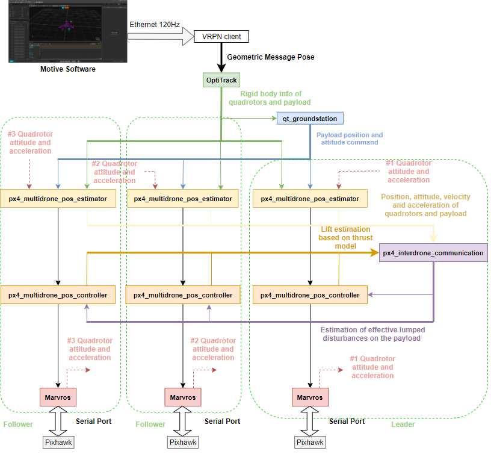
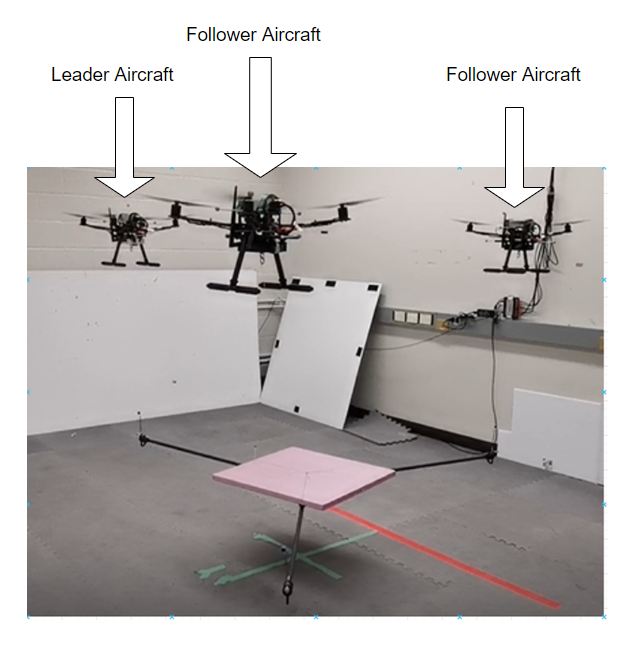
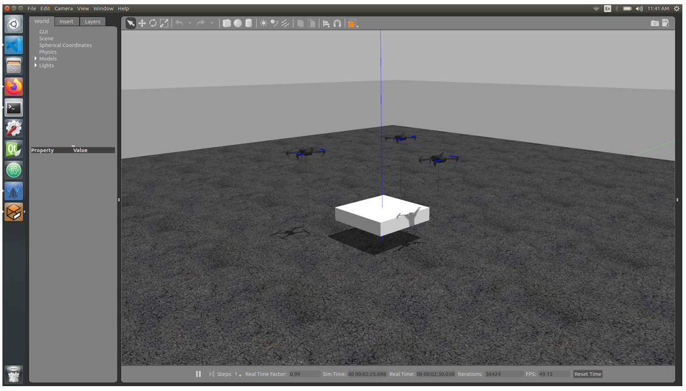

# Flight controller for multiple quadrotors carrying a tethered payload

  

The controller runs on the Nvida Jeston Nano on each quadrotor. The command is sent by ground station from the ground station desktop. 

# Installation

1. Install the mavros packgae by Binary installation
   
    Please ref to: https://github.com/mavlink/mavros
    
    If you has install the mavros package by source code. Plaese deleat it firstly.
   
2. Create a new ros space called "px4_ws" in your home folder
  
    `mkdir -p ~/px4_ws/src`
  
    `cd ~/px4_ws/src`
  
    `catkin_init_workspace`
    
    Please source manually, open a new terminal
    
    `gedit .bashrc`  
    
    Add the path `source /home/$(your computer name)/px4_ws/devel/setup.bash` in the end of the bashrc.txt file

3. Git clone the px4_command package
    
    `cd ~/px4_ws/src`
	
    download from gitlab repository
    
    `git clone http://gitlab.amovauto.com/amovlab/px4_command`
    
    download from github repository

    `git clone https://github.com/potato77/px4_command`
    
    `cd ..`
    
    `catkin_make`
    
# Coordinate frames

   Here we are using **ENU** frames.

  >  MAVROS does translate Aerospace NED frames, used in FCUs to ROS ENU frames and vice-versa. For translate airframe related data we simply apply rotation 180° about ROLL (X) axis. For local we apply 180° about ROLL (X) and 90° about YAW (Z) axes

# Overal node structure

# Quadrotor fleet

# Run the code on experiment drones

# Run the software-in-the-loop (SITL) simulation

